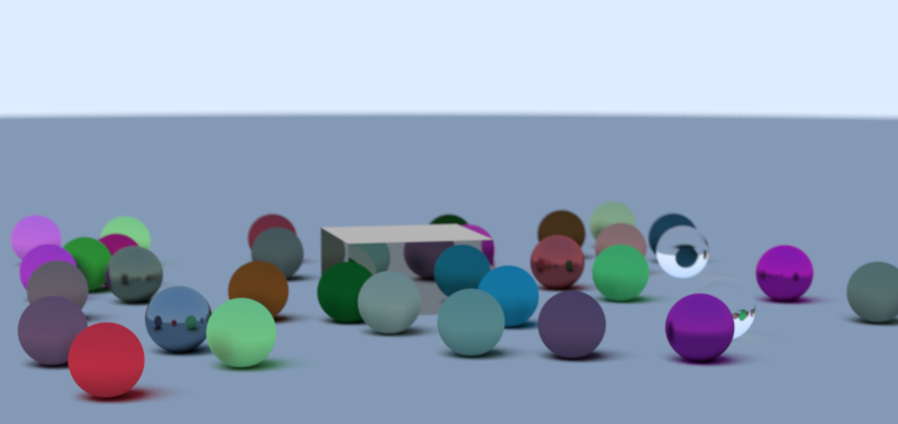

# Ray-Tracing
Offline ray tracing render
## Sample



## Run

Build:

```shell
g++ -o tracer main.cpp
```

Run:

For Windows:

```shell
./tracer.exe > tracer.ppm
```

Linux / Mac:

```shell
tracer.exe > tracer.ppm
```

The result is saved in PPM format. Please use [PPMViewer](https://www.cs.rhodes.edu/welshc/COMP141_F16/ppmReader.html) to preview.

For more shapes, add new class imitating `sphere.h`